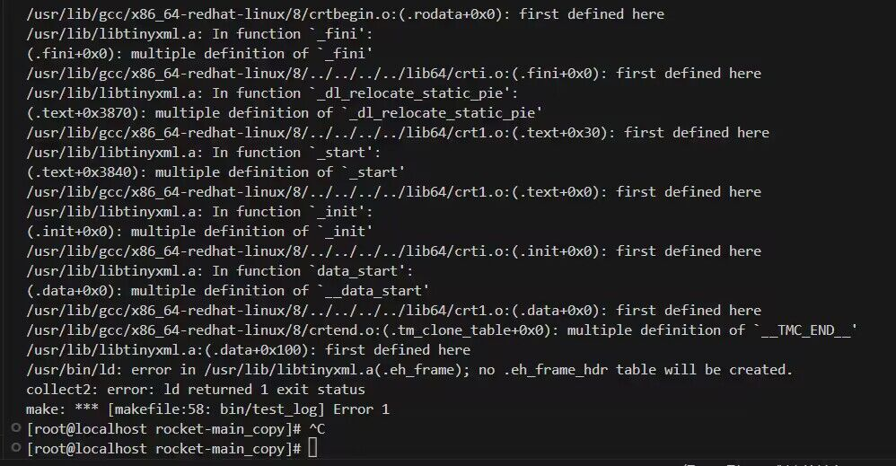

# rocket

## 1.总览
rocket 是基于 C++11 开发的一款多线程的异步 RPC 框架，它旨在高效、简洁的同时，又保持至极高的性能。

rocket 同样是基于主从 Reactor 架构，底层采用 epoll 实现 IO 多路复用。应用层则基于 protobuf 自定义 rpc 通信协议，同时也将支持简单的 HTTP 协议。


这里额外提一句 tinyrpc，看过我之前文章的同学们应该都知道这个。然而很多交流群里的同学都反映 tinyrpc 不是那么容易理解，有种无从下手的感觉。

因此，就引入了 tinyrpc 的简洁版，去掉 tinyrpc 一些晦涩或者不必要的地方，如协程等，但保留其核心的架构，命名为 rocket-rpc.

同时，专门为此项目开设视频课程，将从零开始一步步搭建 rpc 框架，帮助各位同学更好的理解 rpc 的原理。

附：tinyrpc - https://github.com/Gooddbird/tinyrpc


### 1.1 技术栈关键词
- c++11
- protobuf
- rpc
- reactor
- http

### 1.2 学习本课程之前，你需要掌握什么知识？
- 掌握 C++ 语言，至少能熟悉主要的语法、面向对象编程方法等
- 掌握 Linux 环境，熟悉 Linux 网络编程、Socket 编程 等
- 熟悉 Reactor 架构
- 了解 Git 及相关命令
- 了解计算机网络相关知识，如 Tcp 等
- 了解 Protobuf，可以能看懂和编写简单的 protobuf 协议文件
- 了解 rpc 通信原理

### 1.3 学习本课程之后，你将得到哪些知识？
至少当你跟着视频完整开发一遍之后，你将学习到以下技术：
- 一键搭建高性能 rpc 服务，可用于个人网站建站
- 熟悉 RPC 通信的原理，能举一反三，看懂 grpc 等框架
- 熟悉 Reactor 架构，并横向扩展，理解 muduo 等网络框架
- 熟悉 Linux 下 C++ 工程项目开发的通用套路

### 1.4 课程计划
整个项目按以下大纲进行：
- 前置准备，包括环境搭建、依赖库安装
- 日志及配置类开发
- Reactor 核心模块
- Tcp 模块封装
- 序列化、编解码模块
- Rpc 模块封装
- 脚手架搭建
- 简单性能测试

```
1. 环境安装与项目开发
1.1 环境搭建和依赖库安装
1.2 日志模块开发
1.3 配置模块开发

2. EventLoop 模块封装
2.1 EventLoop 核心类构建
2.2 FdEvent 封装以及测试
2.3 定时器 Timer
2.4 主从 Reactor 
2.5 EventLoop 模块整体测试

3. Tcp 模块封装
3.1 TcpBuffer
3.2 TcpConnection 
3.3 TcpServer (一)
3.4 TcpServer (二)
3.4 TcpClient
3.5 Tcp 模块测试 (一)
3.5 Tcp 模块测试 (二)


4. RPC 协议封装
4.1 TinyPB 协议编码
4.2 TinyPB 协议解码
4.3 编解码模块测试

5. RPC 通信模块封装
5.1 RpcController 以及 RcpClosure 等基础类
5.2 RpcDispatcher 分发器
5.3 RpcChannel
5.4 RpcAsyncChannel
5.5 Rpc 模块集成测试

6. RPC 脚手架封装
6.1 代码生成器开发
6.2 项目的构建与测试

```


## 2. 前置准备
### 2.1 环境搭建
- 开发环境：Linux，可以是虚拟机。推荐跟我保持一致，Centos8 的虚拟机. 包含必要的 C++ 开发工具，如 GCC/G++(至少能支持到 C++11 语法的版本)
- 开发工具：VsCode，通过 ssh 远程连接 linux 机器

### 2.2 依赖库的安装
#### 2.2.1 protobuf
protobuf 推荐使用 3.19.4 及其以上：

安装过程：
```
wget  https://github.com/protocolbuffers/protobuf/releases/download/v3.19.4/protobuf-cpp-3.19.4.tar.gz

tar -xzvf protobuf-cpp-3.19.4.tar.gz
```

我们需要指定 安装路径在 `/usr` 目录下:
```
cd protobuf-cpp-3.19.4

./configure -prefix=/usr/local

make -j4 

sudo make install
```

安装完成后，你可以找到头文件将位于 `/usr/include/google` 下，库文件将位于 `/usr/lib` 下。

#### 2.2.2 tinyxml
项目中使用到了配置模块，采用了 xml 作为配置文件。因此需要安装 libtinyxml 解析 xml 文件。

```
wget https://udomain.dl.sourceforge.net/project/tinyxml/tinyxml/2.6.2/tinyxml_2_6_2.zip

unzip tinyxml_2_6_2.zip

```

### 2.3 日志模块开发
首先需要创建项目：

日志模块：
```
1. 日志级别
2. 打印到文件，支持日期命名，以及日志的滚动。
3. c 格式化风控
4. 线程安全
```

LogLevel:
```
Debug
Info
Error
```

LogEvent:
```
文件名、行号
MsgNo
进程号
Thread id
日期，以及时间。精确到 ms
自定义消息
```

日志格式
```
[Level][%y-%m-%d %H:%M:%s.%ms]\t[pid:thread_id]\t[file_name:line][%msg]
```

Logger 日志器
1.提供打印日志的方法
2.设置日志输出的路径


### 2.4 Reactor
Reactor，又可以称为 EventLoop，它的本质是一个事件循环模型。

Rractor(或称 EventLoop)，它的核心逻辑是一个 loop 循环，使用伪代码描述如下：

```c++{.line-numbers}
void loop() {
  while(!stop) {
      foreach (task in tasks) {
        task();
      }

      // 1.取得下次定时任务的时间，与设定time_out去较大值，即若下次定时任务时间超过1s就取下次定时任务时间为超时时间，否则取1s
      int time_out = Max(1000, getNextTimerCallback());
      // 2.调用Epoll等待事件发生，超时时间为上述的time_out
      int rt = epoll_wait(epfd, fds, ...., time_out); 
      if(rt < 0) {
          // epoll调用失败。。
      } else {
          if (rt > 0 ) {
            foreach (fd in fds) {
              // 添加待执行任务到执行队列
              tasks.push(fd);
            }
          }
      }
      
      
  }
}
```

在 rocket 里面，使用的是主从 Reactor 模型，如下图所示：


服务器有一个mainReactor和多个subReactor。

mainReactor由主线程运行，他作用如下：通过epoll监听listenfd的可读事件，当可读事件发生后，调用accept函数获取clientfd，然后随机取出一个subReactor，将cliednfd的读写事件注册到这个subReactor的epoll上即可。也就是说，mainReactor只负责建立连接事件，不进行业务处理，也不关心已连接套接字的IO事件。

subReactor通常有多个，每个subReactor由一个线程来运行。subReactor的epoll中注册了clientfd的读写事件，当发生IO事件后，需要进行业务处理。

#### 2.4.1 TimerEvent 定时任务
```
1. 指定时间点 arrive_time
2. interval, ms。
3. is_repeated 
4. is_cancled
5. task


cancle()
cancleRepeated()
```

#### 2.4.2 Timer
定时器，他是一个 TimerEvent 的集合。
Timer 继承 FdEvent
```

addTimerEvent();
deleteTimerEvent();

onTimer();    // 当发生了 IO 事件之后，需要执行的方法


reserArriveTime()

multimap 存储 TimerEvent <key(arrivetime), TimerEvent>
```

#### 2.5 IO 线程
创建一个IO 线程，他会帮我们执行：
1. 创建一个新线程（pthread_create）
2. 在新线程里面 创建一个 EventLoop，完成初始化
3. 开启 loop
```
class {


 pthread_t m_thread;
 pid_t m_thread_id;
 EventLoop event_loop;
}

```

RPC 服务端流程
```
启动的时候就注册OrderService 对象。


1. 从buufer读取数据，然后 decode 得到请求的 TinyPBProtobol 对象。然后从请求的 TinyPBProtobol 得到 method_name, 从 OrderService 对象里根据 service.method_name 找到方法 func
2. 找到对应的 requeset type 以及 response type
3. 将请求体 TinyPBProtobol 里面的 pb_date 反序列化为 requeset type 的一个对象, 声明一个空的 response type 对象
4. func(request, response)
5. 将 reponse 对象序列为 pb_data。 再塞入到 TinyPBProtobol 结构体中。做 encode 然后塞入到buffer里面，就会发送回包了
```


# 常见问题
## 1. 重要！！！ 库文件安装路径
### 1.1 tinyxml
以tinyxml 为例，tinyxml 分为库文件 `libtinyxml.a` 和头文件 `tinyxml/*.h`

其中库文件一定需要安装在 `/usr/lib` 目录下，即绝对路径为 `/usr/lib/libtinyxml.a` ，如果不一致，请拷贝过去

而头文件，所有 `*.h` 的头文件，必须位于 `tinyxml/` 目录下，而整个 `tinyxml` 目录需要放在 `usr/include` 下，即绝对路径为 `/usr/include/tinyxml`, `tinyxml` 下包含所有的 `.h` 结尾的头文件

### 1.2 protobuf
同 tinyxml，库文件在 `/usr/lib/libprotobuf.a`, 所有头文件 `*.h` 在 `/usr/include/google/protobuf/` 下


## 2. 如何确保 protobuf 库安装成功？
1. 确保头文件、库文件安装无误
2. 确保能 执行 protoc 命令
```
[ikerli@localhost protobuf]$ protoc --version
libprotoc 3.19.4
```


## 3. invalid version 3(max 0)
出现此问题，一般是安装的 libtinyxml.a 有问题，使用以下代码替换原始 tinyxml 的makefile, 然后重装 libtinyxml.a
```
#****************************************************************************
#
# Makefile for TinyXml test.
# Lee Thomason
# www.grinninglizard.com
#
# This is a GNU make (gmake) makefile
#****************************************************************************

# DEBUG can be set to YES to include debugging info, or NO otherwise
DEBUG          := NO

# PROFILE can be set to YES to include profiling info, or NO otherwise
PROFILE        := NO

# TINYXML_USE_STL can be used to turn on STL support. NO, then STL
# will not be used. YES will include the STL files.
TINYXML_USE_STL := NO

#****************************************************************************

CC     := gcc
CXX    := g++
LD     := g++
AR     := ar rc
RANLIB := ranlib

DEBUG_CFLAGS     := -Wall -Wno-format -g -DDEBUG
RELEASE_CFLAGS   := -Wall -Wno-unknown-pragmas -Wno-format -O3

LIBS		 :=

DEBUG_CXXFLAGS   := ${DEBUG_CFLAGS} 
RELEASE_CXXFLAGS := ${RELEASE_CFLAGS}

DEBUG_LDFLAGS    := -g
RELEASE_LDFLAGS  :=

ifeq (YES, ${DEBUG})
   CFLAGS       := ${DEBUG_CFLAGS}
   CXXFLAGS     := ${DEBUG_CXXFLAGS}
   LDFLAGS      := ${DEBUG_LDFLAGS}
else
   CFLAGS       := ${RELEASE_CFLAGS}
   CXXFLAGS     := ${RELEASE_CXXFLAGS}
   LDFLAGS      := ${RELEASE_LDFLAGS}
endif

ifeq (YES, ${PROFILE})
   CFLAGS   := ${CFLAGS} -pg -O3
   CXXFLAGS := ${CXXFLAGS} -pg -O3
   LDFLAGS  := ${LDFLAGS} -pg
endif

#****************************************************************************
# Preprocessor directives
#****************************************************************************

ifeq (YES, ${TINYXML_USE_STL})
  DEFS := -DTIXML_USE_STL
else
  DEFS :=
endif

#****************************************************************************
# Include paths
#****************************************************************************

#INCS := -I/usr/include/g++-2 -I/usr/local/include
INCS :=


#****************************************************************************
# Makefile code common to all platforms
#****************************************************************************

CFLAGS   := ${CFLAGS}   ${DEFS}
CXXFLAGS := ${CXXFLAGS} ${DEFS}

#****************************************************************************
# Targets of the build
#****************************************************************************

OUTPUT := libtinyxml.a 

all: ${OUTPUT}


#****************************************************************************
# Source files
#****************************************************************************

SRCS := tinyxml.cpp tinyxmlparser.cpp xmltest.cpp tinyxmlerror.cpp tinystr.cpp

# Add on the sources for libraries
SRCS := ${SRCS}

OBJS := $(addsuffix .o,$(basename ${SRCS}))

#****************************************************************************
# Output
#****************************************************************************

${OUTPUT}: ${OBJS}
	${AR} $@ ${LDFLAGS} ${OBJS} ${LIBS} ${EXTRA_LIBS}

#****************************************************************************
# common rules
#****************************************************************************

# Rules for compiling source files to object files
%.o : %.cpp
	${CXX} -c ${CXXFLAGS} ${INCS} $< -o $@

%.o : %.c
	${CC} -c ${CFLAGS} ${INCS} $< -o $@

dist:
	bash makedistlinux

clean:
	-rm -f core ${OBJS} ${OUTPUT}

depend:
	#makedepend ${INCS} ${SRCS}

tinyxml.o: tinyxml.h tinystr.h
tinyxmlparser.o: tinyxml.h tinystr.h
xmltest.o: tinyxml.h tinystr.h
tinyxmlerror.o: tinyxml.h tinystr.h
```

## 4. multiple definition of __TMC_END__
编译时出现以下多重定义错误


处理方法同问题3，重新安装 libtinyxml.a 即可


## 5. testcases/order.pb.cc: No such file or directory
```
-Wno-unused-but-set-variable -I./ -Irocket  -Irocket/common -Irocket/net -Irocket/net/tcp -Irocket/net/coder -Irocket/net/rpc testcases/test_rpc_client.cc testcases/order.pb.cc -o bin/test_rpc_client lib/librocket.a /usr/lib/libprotobuf.a    /usr/lib/libtinyxml.a -ldl -pthread
g++: error: testcases/order.pb.cc: No such file or directory
make: *** [makefile:71: bin/test_rpc_client] Error 1
make: *** Waiting for unfinished jobs....
```
出现此错误时，是因为本地没有用 `protoc` 命令生成文件，需要执行：
```
cd testcases
protoc --cpp_out=./ order.proto
```
观察是否在当前目录生成了 `order.pb.h` 和 `order.pb.cc` 两个文件，生成成功后重新编译

## 6. 重要! 目录层次结构
**请一定保持一样的目录结构，最外层的文件夹命名可以任意.**
```
rocket
  - bin
    -- 存放测试程序，可执行程序
  - conf
    -- 存放测试用的xml配置文件
  - lib
    -- 存放编译完成的静态库 librocket.a
  - obj
    -- 存放所有编译主键文件，*.o
  - rocket
    -- 存放所有源代码
  - testcases
    -- 存放测试代码
```


## x. 其他问题？如果是代码崩溃异常退出，请提供 gdb 的堆栈信息
假设可执行文件为 x
```
执行 gdb x
执行 r 命令，直到崩溃此时 gdb 会暂停
执行 bt 命令，打印出函数调用堆栈信息，尝试自己先分析，如果分析不出来可以提供给我
```

# 代码设计问题
## 0. 项目的重点？
rocket 是基于 C++11 开发的异步 RPC 框架，它的特点如下：
- 性能高：主从 Reactor 架构，多线程并发处理. 底层通过 epoll 多路复用
- 异步：支持异步 RPC 调用，主调方需要同步等待返回
- 序列化：基于 Prtobuf 序列化数据，协议轻量化，传输效率高
- 框架化：实现 Generator 代码生成器，一键生成 RPC 框架，提升开发效率.
- 业务解耦：业务开发人员开箱即用，无需关注任何底层框架逻辑
- 异步日志：日志支持按日期、大小滚动；并有异步线程负责输出，提升效率
- 配置化：提供 xml 配置模块，启动时自加载配置文件 

## 1. RPC 是什么？
RPC 原理见博客：
https://www.zhihu.com/question/41609070/answer/2394467493

## 2. 这个项目产出物是什么？
整个项目的产出，是一个库文件 `librocket.a` 和一系列头文件`rocket/*.h`. 注意，库文件不是可执行程序，他不包含 main 函数，不能直接运行，需要我们写具体的 main 函数并且链接这个库。

不过这是个繁琐且重复的过程，想想，你每搭建一个 RPC 服务，就要写 makefile，写 main 函数，写重复的接口代码等等，也就是说，绝大部分动作都是重复的。为了解决重复的问题，rocket 提供了更加优质的封装，使用了代码生成器 `generator`，能够一键生成 RPC 服务代码，帮助我们写好 makefile、接口等逻辑。使用者完全不用感知任何底层逻辑。

## 3. 如何使用 Generator 生成代码？
假设需要搭建一个 RPC 服务，服务的作用是提供下单接口，实现订单生产逻辑。首先，找到 rocket_generator.py 文件，复制其绝对路径，如：/data/home/ikerli/new-workspace/rocket/generator/rocket_generator.py

然后，进入任意一个目录下，首先创建一个 protobuf 的文件，如
cd /data/home/ikerli/new-workspace
vim order.proto

这里给实例 order.proto 如下
```
syntax = "proto3";
option cc_generic_services = true;

message makeOrderRequest {
  int32 price = 1;
  string goods = 2;
}

message makeOrderResponse {
  int32 ret_code = 1;
  string res_info = 2;
  string order_id = 3;
}

service Order {
  rpc makeOrder(makeOrderRequest) returns (makeOrderResponse);
}
```

然后执行命令：
python3 rocket/generator/rocket_generator.py -i order.proto -o ./

-i: 代表源文件，需要是你创建的 proto 文件
-o: 生成文件的根路径

因此，此行代码的含义是通过 order.proto 文件，在当前目录下生成 RPC 框架代码

注意，你需要安装 Python3 才能执行
执行成功后，可以看到当前路径下生成了一个 order 的目录：
```
order:
  -bin: 可执行程序路径，make 成功后会在此目录下生成可执行文件，可以直接运行
    - run.sh 启动 RPC 脚本
    - shutdown.sh 停止 RPC 脚本
  -conf: 配置文件路径，存放 rocket.xml 配置文件，一般不需要修改
  -lib:  库文件路径，存放静态库文件
  -obj: 库文件路径，存放一些编译的中间文件(*.o)
  -log: 日志路径，启动 RPC 服务后会在此路径下生成日志文件
  -test_client: 测试文件目录，提供测试 RPC 接口的程序
  -order: 项目源代码路径
    - comm: 存放一些公共文件
    - interface:
      - make_order.h: 对应 rpc makeOrder(makeOrderRequest) returns (makeOrderResponse) ，每个定义在 proto 下 service 下的 rpc 方法，都会在此目录下生成一个接口
      - make_order.cc
      - interface.h: 接口基类文件，每个 RPC 接口都继承此类，可以方便写一些多接口共用的公共逻辑
      - interface.cc
    - pb:
      - order.pb.h: 使用 protoc 命令根据 order.proto 生成的文件
      - order.pb.cc:  使用 protoc 命令根据 order.proto 生成的文件
      - order.ptoto: 原始 proto 文件，这里只是将源文件拷贝过来的
    - service:
      - order.cc: 负责将 RPC 请求分发到对应的 interface 下的接口
      - order.h:
    - main.cc: RPC 启动程序，main 函数在此处实现
    - makefile: 项目 makefile, 正常可以直接执行 make

```

注意，这里只是实例，实际的 proto 文件是根据具体的业务逻辑来设计的，简单来说就是根据 RPC 服务的业务行为，设计对应的接口、请求参数、返回参数.
只需要注意一个点，就是 RPC 接口的返回参数必须有两个字段：ret_code 和 res_info。
例如要实现一个支付服务，就可以是：
pay.proto:
```
syntax = "proto3";
option cc_generic_services = true;

// 支付请求
message payRequest {
  int32 amount = 1; // 支付金额
}

message makeOrderResponse {
  int32 ret_code = 1;
  string res_info = 2;
  string pay_result = 3; 支付结果
}

service Order {
  rpc makeOrder(makeOrderRequest) returns (makeOrderResponse);
}
```
然后基于这个 pay.proto 搭建 RPC 服务用作支付。


## 4. 如何理解 proto 文件
以上面的 `order.proto` 为例，本质上我们使用的其实是 `protoc` 生成的 `order.pb.h` 和 `order.pb.cc` 文件。
message xxx: 就是结构体，或者理解为 class 类就好了，简单来说就是对一些变量进行封装，在 pb.h 会生成对应的 class 类。

service xxx:对应的是 RPC 服务里面的 Service，例如在上面的 main.cc 函数里面：
```
rocket::RpcDispatcher::GetRpcDispatcher()->registerService(std::make_shared<order::OrderServiceImpl>());
```
这里注册的 service 是 `OrderImpl` 类，但这个类是继承自 `Order` 类的，`Order` 类就是 `service Order` 生成，这里就把 protobuf 和 RPC 服务联系起来了。

rpc xxx: 很重要，这里就是具体的接口了，对于每一个接口，Generator 会再 interface 下生成对应的接口文件。

在RPC请求包里面有个字段 method_name，即方法名。它实际上应该是 proto 文件里的 service.method， 例如 Order.makeOrder，就代表需要调用 Order 这个 Service 下的 makeOrder 方法。RPC 服务端收到请求后，而 OrderImpl 继承于 Order，并且重写了 makeOrder 方法，在重写的 makeOrder 方法里面调用到具体的 interface 下的接口。


## 5. 为什么 RPC 接口返回必须有两个字段 ret_code 和 res_info?
这是为了简化 RPC 处理逻辑，调用 RPC 就跟调用函数一样，有可能成功，当然也可能失败。举个例子，调用 read 函数时，我们常常以返回值是否为 0 来判断调用是否成功，当返回值不为0的时候，调用 errno 获取系统错误。这就像一种错误处理标准一样，Linux 下很多函数都是这中标准。RPC 本质也是调用远程方法，因此，我们通过强约束接口返回参数的 ret_code（返回值） 和 res_info（返回信息），当 ret_code 不为0的时候，说明 RPC 服务处理此次请求的时候发生了非预期的错误，通过 res_info 可以获取详细的错误信息。举个例子，当调用支付接口失败后，我可以调用 res_info 获取失败的原因，比如余额不足。
当然，作为 RPC 服务方，必须负责在出错时将错误信息设置为 ret_code 以及 res_info 中。这个已经用 'generator' 生成器进行处理，当RPC接口处理业务逻辑抛出异常时，会将异常码以及异常信息设置到对应的字段。

## 6. 如何分析 RPC 调用过程？
### 6.1 客户端角度
参考 rocket 中的 test_rpc_client.cc 文件：
``` cpp {.line-numbers} 
void test_rpc_channel() {

  NEWRPCCHANNEL("127.0.0.1:12345", channel);

  // std::shared_ptr<makeOrderRequest> request = std::make_shared<makeOrderRequest>();

  NEWMESSAGE(makeOrderRequest, request);
  NEWMESSAGE(makeOrderResponse, response);

  request->set_price(100);
  request->set_goods("apple");

  NEWRPCCONTROLLER(controller);
  controller->SetMsgId("99998888");
  controller->SetTimeout(10000);

  std::shared_ptr<rocket::RpcClosure> closure = std::make_shared<rocket::RpcClosure>(nullptr, [request, response, channel, controller]() mutable {
    if (controller->GetErrorCode() == 0) {
      INFOLOG("call rpc success, request[%s], response[%s]", request->ShortDebugString().c_str(), response->ShortDebugString().c_str());
      // 执行业务逻辑
      if (response->order_id() == "xxx") {
        // xx
      }
    } else {
      ERRORLOG("call rpc failed, request[%s], error code[%d], error info[%s]", 
        request->ShortDebugString().c_str(), 
        controller->GetErrorCode(), 
        controller->GetErrorInfo().c_str());
    }
  
    INFOLOG("now exit eventloop");
    // channel->getTcpClient()->stop();
    channel.reset();
  });
  
  std::shared_ptr<rocket::RpcChannel> channel = std::make_shared<rocket::RpcChannel>(rocket::RpcChannel::FindAddr("127.0.0.1:12345"));
  channel->Init(controller, request, response, closure);
  Order_Stub(channel.get()).makeOrder(controller.get(), request.get(), response.get(), closure.get());
}
```
整个 RPC 调用其实是从 Order_Stub.makeOrder 开始,而 Order_Stub 对象是用 channel 初始化的，channel 里面指定了对端的 ip port 为 `127.0.0.1:12345`
进入到 Order_Stub.makeOrder, 发现其调用的是 channel_->CallMethod 方法
```cpp {.line-numbers}
// order.pb.cc

void Order_Stub::makeOrder(::PROTOBUF_NAMESPACE_ID::RpcController* controller,
                              const ::makeOrderRequest* request,
                              ::makeOrderResponse* response,
                              ::google::protobuf::Closure* done) {
  channel_->CallMethod(descriptor()->method(0),
                       controller, request, response, done);
}
```

自然，下一步就到了 RpcChannel->CallMethod() 方法

``` cpp {.line-numbers}
// rocket/net/rpc/rpc_channel.cc

void RpcChannel::CallMethod(const google::protobuf::MethodDescriptor* method,
                        google::protobuf::RpcController* controller, const google::protobuf::Message* request,
                        google::protobuf::Message* response, google::protobuf::Closure* done) {


  std::shared_ptr<rocket::TinyPBProtocol> req_protocol = std::make_shared<rocket::TinyPBProtocol>();

  RpcController* my_controller = dynamic_cast<RpcController*>(controller);
  if (my_controller == NULL || request == NULL || response == NULL) {
    ERRORLOG("failed callmethod, RpcController convert error");
    my_controller->SetError(ERROR_RPC_CHANNEL_INIT, "controller or request or response NULL");
    callBack();
    return;
  }

  if (m_peer_addr == nullptr) {
    ERRORLOG("failed get peer addr");
    my_controller->SetError(ERROR_RPC_PEER_ADDR, "peer addr nullptr");
    callBack();
    return;
  }

  m_client = std::make_shared<TcpClient>(m_peer_addr);

  if (my_controller->GetMsgId().empty()) {
    // 先从 runtime 里面取, 取不到再生成一个
    // 这样的目的是为了实现 msg_id 的透传，假设服务 A 调用了 B，那么同一个 msgid 可以在服务 A 和 B 之间串起来，方便日志追踪
    std::string msg_id = RunTime::GetRunTime()->m_msgid;
    if (!msg_id.empty()) {
      req_protocol->m_msg_id = msg_id;
      my_controller->SetMsgId(msg_id);
    } else {
      req_protocol->m_msg_id = MsgIDUtil::GenMsgID();
      my_controller->SetMsgId(req_protocol->m_msg_id);
    }

  } else {
    // 如果 controller 指定了 msgno, 直接使用
    req_protocol->m_msg_id = my_controller->GetMsgId();
  }

  req_protocol->m_method_name = method->full_name();
  INFOLOG("%s | call method name [%s]", req_protocol->m_msg_id.c_str(), req_protocol->m_method_name.c_str());

  if (!m_is_init) {
    std::string err_info = "RpcChannel not call init()";
    my_controller->SetError(ERROR_RPC_CHANNEL_INIT, err_info);
    ERRORLOG("%s | %s, RpcChannel not init ", req_protocol->m_msg_id.c_str(), err_info.c_str());
    callBack();
    return;
  }

  // requeset 的序列化
  if (!request->SerializeToString(&(req_protocol->m_pb_data))) {
    std::string err_info = "failde to serialize";
    my_controller->SetError(ERROR_FAILED_SERIALIZE, err_info);
    ERRORLOG("%s | %s, origin requeset [%s] ", req_protocol->m_msg_id.c_str(), err_info.c_str(), request->ShortDebugString().c_str());
    callBack();
    return;
  }

  s_ptr channel = shared_from_this(); 

  TimerEvent::s_ptr timer_event = std::make_shared<TimerEvent>(my_controller->GetTimeout(), false, [my_controller, channel]() mutable {
    INFOLOG("%s | call rpc timeout arrive", my_controller->GetMsgId().c_str());
    if (my_controller->Finished()) {
      channel.reset();
      return;
    }

    my_controller->StartCancel();
    my_controller->SetError(ERROR_RPC_CALL_TIMEOUT, "rpc call timeout " + std::to_string(my_controller->GetTimeout()));

    channel->callBack();
    channel.reset();
  });

  m_client->addTimerEvent(timer_event);

  m_client->connect([req_protocol, this]() mutable {

    RpcController* my_controller = dynamic_cast<RpcController*>(getController());

    if (getTcpClient()->getConnectErrorCode() != 0) {
      my_controller->SetError(getTcpClient()->getConnectErrorCode(), getTcpClient()->getConnectErrorInfo());
      ERRORLOG("%s | connect error, error coode[%d], error info[%s], peer addr[%s]", 
        req_protocol->m_msg_id.c_str(), my_controller->GetErrorCode(), 
        my_controller->GetErrorInfo().c_str(), getTcpClient()->getPeerAddr()->toString().c_str());

      callBack();

      return;
    }

    INFOLOG("%s | connect success, peer addr[%s], local addr[%s]",
      req_protocol->m_msg_id.c_str(), 
      getTcpClient()->getPeerAddr()->toString().c_str(), 
      getTcpClient()->getLocalAddr()->toString().c_str()); 

    getTcpClient()->writeMessage(req_protocol, [req_protocol, this, my_controller](AbstractProtocol::s_ptr) mutable {
      INFOLOG("%s | send rpc request success. call method name[%s], peer addr[%s], local addr[%s]", 
        req_protocol->m_msg_id.c_str(), req_protocol->m_method_name.c_str(),
        getTcpClient()->getPeerAddr()->toString().c_str(), getTcpClient()->getLocalAddr()->toString().c_str());

        getTcpClient()->readMessage(req_protocol->m_msg_id, [this, my_controller](AbstractProtocol::s_ptr msg) mutable {
        std::shared_ptr<rocket::TinyPBProtocol> rsp_protocol = std::dynamic_pointer_cast<rocket::TinyPBProtocol>(msg);
        INFOLOG("%s | success get rpc response, call method name[%s], peer addr[%s], local addr[%s]", 
          rsp_protocol->m_msg_id.c_str(), rsp_protocol->m_method_name.c_str(),
          getTcpClient()->getPeerAddr()->toString().c_str(), getTcpClient()->getLocalAddr()->toString().c_str());

        if (!(getResponse()->ParseFromString(rsp_protocol->m_pb_data))){
          ERRORLOG("%s | serialize error", rsp_protocol->m_msg_id.c_str());
          my_controller->SetError(ERROR_FAILED_SERIALIZE, "serialize error");
          callBack();
          return;
        }

        if (rsp_protocol->m_err_code != 0) {
          ERRORLOG("%s | call rpc methood[%s] failed, error code[%d], error info[%s]", 
            rsp_protocol->m_msg_id.c_str(), rsp_protocol->m_method_name.c_str(),
            rsp_protocol->m_err_code, rsp_protocol->m_err_info.c_str());

          my_controller->SetError(rsp_protocol->m_err_code, rsp_protocol->m_err_info);
          callBack();
          return;
        }

        INFOLOG("%s | call rpc success, call method name[%s], peer addr[%s], local addr[%s]",
          rsp_protocol->m_msg_id.c_str(), rsp_protocol->m_method_name.c_str(),
          getTcpClient()->getPeerAddr()->toString().c_str(), getTcpClient()->getLocalAddr()->toString().c_str())

        callBack();
      
      });

    });

  });
}
```

在 callMethod 里面，首先创建了 `req_protocol` 对象，即为请求的数据包结构体，将 request 序列化后的结果放进去，以及 msgno、method_name 填充进去。注意，这里填充的 method_name 就是 service.method，拿这个来说就是 `Order.makeOrder`.
然后就是连接、发送、等待回包了，拿连接 connect 举例，这里调用的是 TcpClient::connect() 方法，然后传入了回调函数。

先看看 connect 的逻辑:
``` cpp {.line-numbers}
// 异步的进行 conenct
// 如果connect 成功，done 会被执行
void TcpClient::connect(std::function<void()> done) {
  int rt = ::connect(m_fd, m_peer_addr->getSockAddr(), m_peer_addr->getSockLen());
  if (rt == 0) {
    DEBUGLOG("connect [%s] sussess", m_peer_addr->toString().c_str());
    m_connection->setState(Connected);
    initLocalAddr();
    if (done) {
      done();
    }
  } else if (rt == -1) {
    if (errno == EINPROGRESS) {
      // epoll 监听可写事件，然后判断错误码
      m_fd_event->listen(FdEvent::OUT_EVENT, 
        [this, done]() {
          int rt = ::connect(m_fd, m_peer_addr->getSockAddr(), m_peer_addr->getSockLen());
          if ((rt < 0 && errno == EISCONN) || (rt == 0)) {
            DEBUGLOG("connect [%s] sussess", m_peer_addr->toString().c_str());
            initLocalAddr();
            m_connection->setState(Connected);
          } else {
            if (errno == ECONNREFUSED) {
              m_connect_error_code = ERROR_PEER_CLOSED;
              m_connect_error_info = "connect refused, sys error = " + std::string(strerror(errno));
            } else {
              m_connect_error_code = ERROR_FAILED_CONNECT;
              m_connect_error_info = "connect unkonwn error, sys error = " + std::string(strerror(errno));
            }
            ERRORLOG("connect errror, errno=%d, error=%s", errno, strerror(errno));
            close(m_fd);
            m_fd = socket(m_peer_addr->getFamily(), SOCK_STREAM, 0);
          }

          // 连接完后需要去掉可写事件的监听，不然会一直触发
          m_event_loop->deleteEpollEvent(m_fd_event);
          DEBUGLOG("now begin to done");
          // 如果连接完成，才会执行回调函数
          if (done) {
            done();
          }
        }
      );
      m_event_loop->addEpollEvent(m_fd_event);

      if (!m_event_loop->isLooping()) {
        m_event_loop->loop();
      }
    } else {
      ERRORLOG("connect errror, errno=%d, error=%s", errno, strerror(errno));
      m_connect_error_code = ERROR_FAILED_CONNECT;
      m_connect_error_info = "connect error, sys error = " + std::string(strerror(errno));
      if (done) {
        done();
      }
    }
  }

}
```
重点看 13 行，当 errno== EINPROGRESS 时，说明此时连接正在建立中，而判断连接建立成功的条件就是：fd满足可写并且errno不为零。 因此，此时就把 fd 的可写事件添加到 Reactor 中，当满足可写之后，并且 errno 为0，说明连接建立成功了。然后执行我们传入的回调函数。

而这里的回调函数就是先调用 writeMessage 发送 req_protocol, 然后调用 readMessage 等待回包。这两步跟 connect 原理差不多，都是靠 Reactor 来做回调，就不展开了。

当 readMessage 执行完后，就会执行我们传入的回调函数：此时将读到的数据转为 rsp_protocol 协议包，即我们成功得到的 RPC 响应。 将 `rsp_protocol->m_pb_data` 反序列化后，就能得到 response 对象。
最后再执行 callMethod 时传入的回调函数，即执行这一段代码：
``` cpp
// test_rpc_client.cc
    if (controller->GetErrorCode() == 0) {
      INFOLOG("call rpc success, request[%s], response[%s]", request->ShortDebugString().c_str(), response->ShortDebugString().c_str());
      // 执行业务逻辑
      if (response->order_id() == "xxx") {
        // xx
      }
    } else {
      ERRORLOG("call rpc failed, request[%s], error code[%d], error info[%s]", 
        request->ShortDebugString().c_str(), 
        controller->GetErrorCode(), 
        controller->GetErrorInfo().c_str());
    }
  
    INFOLOG("now exit eventloop");
    // channel->getTcpClient()->stop();
    channel.reset();
```
这就是客户端整个 RPC 调用的完整过程了。


### 6.2 服务端角度
服务端要从连接的建立开始说起，首先是客户端调用 connect 时，服务端此时对应的 listenfd 触发可读事件，主线程的 epoll_wait 返回，执行TcpServer::onAccept()
```cpp {.line-numbers}
void TcpServer::onAccept() {
  auto re = m_acceptor->accept();
  int client_fd = re.first;
  NetAddr::s_ptr peer_addr = re.second;

  m_client_counts++;
  
  // 把 cleintfd 添加到任意 IO 线程里面
  IOThread* io_thread = m_io_thread_group->getIOThread();
  TcpConnection::s_ptr connetion = std::make_shared<TcpConnection>(io_thread->getEventLoop(), client_fd, 128, peer_addr, m_local_addr);
  connetion->setState(Connected);

  m_client.insert(connetion);

  INFOLOG("TcpServer succ get client, fd=%d", client_fd);
}
```
服务端最终调用底层的 `accept` 函数，获取一个 clientfd，然后创建从IO线程池任选一个IO线程，利用这些参数创建一个新的 TcpConnect 对象，这一步即完成了 `主线程将 fd 添加到IO 线程` 这个操作。
```cpp {.line-numbers}
TcpConnection::TcpConnection(EventLoop* event_loop, int fd, int buffer_size, NetAddr::s_ptr peer_addr, NetAddr::s_ptr local_addr, TcpConnectionType type /*= TcpConnectionByServer*/)
    : m_event_loop(event_loop), m_local_addr(local_addr), m_peer_addr(peer_addr), m_state(NotConnected), m_fd(fd), m_connection_type(type) {
    
  m_in_buffer = std::make_shared<TcpBuffer>(buffer_size);
  m_out_buffer = std::make_shared<TcpBuffer>(buffer_size);

  m_fd_event = FdEventGroup::GetFdEventGroup()->getFdEvent(fd);
  m_fd_event->setNonBlock();

  m_coder = new TinyPBCoder();

  if (m_connection_type == TcpConnectionByServer) {
    listenRead();
  }

}
```
注意 13 行调用了 `listenRead` 函数，因此将 `clientfd` 的可读事件注册到了当前IO线程的 Reactor 对象中。

紧接着客户端发送 `req_procotol` 后，服务端感知到 `clientfd` 的可读事件，epoll_wait 返回，执行回调函数。而回调函数就是 `TcpConnection::onRead()`

``` cpp{.line-numbers}
void TcpConnection::onRead() {
  // 1. 从 socket 缓冲区，调用 系统的 read 函数读取字节 in_buffer 里面

  if (m_state != Connected) {
    ERRORLOG("onRead error, client has already disconneced, addr[%s], clientfd[%d]", m_peer_addr->toString().c_str(), m_fd);
    return;
  }

  bool is_read_all = false;
  bool is_close = false;
  while(!is_read_all) {
    if (m_in_buffer->writeAble() == 0) {
      m_in_buffer->resizeBuffer(2 * m_in_buffer->m_buffer.size());
    }
    int read_count = m_in_buffer->writeAble();
    int write_index = m_in_buffer->writeIndex(); 

    int rt = read(m_fd, &(m_in_buffer->m_buffer[write_index]), read_count);
    DEBUGLOG("success read %d bytes from addr[%s], client fd[%d]", rt, m_peer_addr->toString().c_str(), m_fd);
    if (rt > 0) {
      m_in_buffer->moveWriteIndex(rt);
      if (rt == read_count) {
        continue;
      } else if (rt < read_count) {
        is_read_all = true;
        break;
      }
    } else if (rt == 0) {
      is_close = true;
      break;
    } else if (rt == -1 && errno == EAGAIN) {
      is_read_all = true;
      break;
    }
  }

  if (is_close) {
    //TODO: 
    INFOLOG("peer closed, peer addr [%s], clientfd [%d]", m_peer_addr->toString().c_str(), m_fd);
    clear();
    return;
  }

  if (!is_read_all) {
    ERRORLOG("not read all data");
  }

  // TODO: 简单的 echo, 后面补充 RPC 协议解析 
  excute();
}
```

在 onRead() 里面，通过 `read` 系统调用将当前socket缓冲区的所有数据读到了 m_in_buffer 里面。确保读完所有数据后，执行 `excute` 函数：
```cpp {.line-numbers}
void TcpConnection::excute() {
  if (m_connection_type == TcpConnectionByServer) {
    // 将 RPC 请求执行业务逻辑，获取 RPC 响应, 再把 RPC 响应发送回去
    std::vector<AbstractProtocol::s_ptr> result;
    m_coder->decode(result, m_in_buffer);
    for (size_t i = 0;  i < result.size(); ++i) {
      // 1. 针对每一个请求，调用 rpc 方法，获取响应 message
      // 2. 将响应 message 放入到发送缓冲区，监听可写事件回包
      INFOLOG("success get request[%s] from client[%s]", result[i]->m_msg_id.c_str(), m_peer_addr->toString().c_str());

      std::shared_ptr<TinyPBProtocol> message = std::make_shared<TinyPBProtocol>();
      // message->m_pb_data = "hello. this is rocket rpc test data";
      // message->m_msg_id = result[i]->m_msg_id;

      RpcDispatcher::GetRpcDispatcher()->dispatch(result[i], message, this);
    }

  }
}
```
excute 里将当前 m_in_buffer 里的数据通过 decode 解码为一个个 TinyPBProtocol 对象，然后调用 `RpcDispatcher::dispatch` 方法进行处理:

``` cpp {.line-numbers}
void RpcDispatcher::dispatch(AbstractProtocol::s_ptr request, AbstractProtocol::s_ptr response, TcpConnection* connection) {
  
  std::shared_ptr<TinyPBProtocol> req_protocol = std::dynamic_pointer_cast<TinyPBProtocol>(request);
  std::shared_ptr<TinyPBProtocol> rsp_protocol = std::dynamic_pointer_cast<TinyPBProtocol>(response);

  std::string method_full_name = req_protocol->m_method_name;
  std::string service_name;
  std::string method_name;

  rsp_protocol->m_msg_id = req_protocol->m_msg_id;
  rsp_protocol->m_method_name = req_protocol->m_method_name;

  if (!parseServiceFullName(method_full_name, service_name, method_name)) {
    setTinyPBError(rsp_protocol, ERROR_PARSE_SERVICE_NAME, "parse service name error");
    return;
  }

  auto it = m_service_map.find(service_name);
  if (it == m_service_map.end()) {
    ERRORLOG("%s | sericve neame[%s] not found", req_protocol->m_msg_id.c_str(), service_name.c_str());
    setTinyPBError(rsp_protocol, ERROR_SERVICE_NOT_FOUND, "service not found");
    return;
  }

  service_s_ptr service = (*it).second;

  const google::protobuf::MethodDescriptor* method = service->GetDescriptor()->FindMethodByName(method_name);
  if (method == NULL) {
    ERRORLOG("%s | method neame[%s] not found in service[%s]", req_protocol->m_msg_id.c_str(), method_name.c_str(), service_name.c_str());
    setTinyPBError(rsp_protocol, ERROR_SERVICE_NOT_FOUND, "method not found");
    return;
  }

  google::protobuf::Message* req_msg = service->GetRequestPrototype(method).New();

  // 反序列化，将 pb_data 反序列化为 req_msg
  if (!req_msg->ParseFromString(req_protocol->m_pb_data)) {
    ERRORLOG("%s | deserilize error", req_protocol->m_msg_id.c_str(), method_name.c_str(), service_name.c_str());
    setTinyPBError(rsp_protocol, ERROR_FAILED_DESERIALIZE, "deserilize error");
    DELETE_RESOURCE(req_msg);
    return;
  }

  INFOLOG("%s | get rpc request[%s]", req_protocol->m_msg_id.c_str(), req_msg->ShortDebugString().c_str());

  google::protobuf::Message* rsp_msg = service->GetResponsePrototype(method).New();

  RpcController* rpc_controller = new RpcController();
  rpc_controller->SetLocalAddr(connection->getLocalAddr());
  rpc_controller->SetPeerAddr(connection->getPeerAddr());
  rpc_controller->SetMsgId(req_protocol->m_msg_id);

  RunTime::GetRunTime()->m_msgid = req_protocol->m_msg_id;
  RunTime::GetRunTime()->m_method_name = method_name;

  RpcClosure* closure = new RpcClosure(nullptr, [req_msg, rsp_msg, req_protocol, rsp_protocol, connection, rpc_controller, this]() mutable {
    if (!rsp_msg->SerializeToString(&(rsp_protocol->m_pb_data))) {
      ERRORLOG("%s | serilize error, origin message [%s]", req_protocol->m_msg_id.c_str(), rsp_msg->ShortDebugString().c_str());
      setTinyPBError(rsp_protocol, ERROR_FAILED_SERIALIZE, "serilize error");
    } else {
      rsp_protocol->m_err_code = 0;
      rsp_protocol->m_err_info = "";
      INFOLOG("%s | dispatch success, requesut[%s], response[%s]", req_protocol->m_msg_id.c_str(), req_msg->ShortDebugString().c_str(), rsp_msg->ShortDebugString().c_str());
    }

    std::vector<AbstractProtocol::s_ptr> replay_messages;
    replay_messages.emplace_back(rsp_protocol);
    connection->reply(replay_messages);

  });

  service->CallMethod(method, rpc_controller, req_msg, rsp_msg, closure);
}

```
dispatch 里面首先将取出请求体里面的 method_full_name("Order.makeOrder")，然后解析为 service_name("Order") 以及 method_name("makeOrder")
第 18 行 通过 service_name 就找到了服务端 `m_service_map` 里的 service 对象.
还记得 `m_service_map` 里的对象是怎么来的吗，见问题 4， 在 main.cc 里面我们执行了
```
rocket::RpcDispatcher::GetRpcDispatcher()->registerService(std::make_shared<order::OrderServiceImpl>());
```
其实这一步就是向 m_service_map 插入了一对元素，其中key 为 "Order"， value 为 `OrderServiceImpl` 的一个对象。

因此，第18行我们就能获取到此 `OrderServiceImpl` 对象 service，由于 `OrderServiceImpl` 继承自 `Order`, 自然他也拥有 `makeOrder` 这个方法。

第27行
```cpp
const google::protobuf::MethodDescriptor* method = service->GetDescriptor()->FindMethodByName(method_name);
```
即可通过方法名（"makeOrder"）找到 service 对象下的 `makeOrder` 这个方法的描述符对象，通过描述符对象，我们可以获取到这个 `makeOrder` 方法的请求类型(`makeOrderRequest`)和返回类型 (`makeOrderResponse`)。有了类型，就可以实例化对象了。

```cpp
if (!req_msg->ParseFromString(req_protocol->m_pb_data)) {
```
首先是 37 行，将客户端请求里面 req_protocol->m_pb_data 反序列化为 req_msg 对象，这就完成了将客户端的请求数据转换为服务端所需要的具体参数。
之后是创建 RpcController 等辅助对象，以及 closure 关键的回调函数。这个回调我们后面再分析，最后一步调用了 service->CallMethod() 方法

从这个例子来说，我们知道 service 是 `OrderServiceImpl` 子类对象，但子类并没有对 `CallMethod`进行重写。 因此这里实际调用到了其父类 `Order` 的 `CallMethod` 方法, 在 protoc 生成的 order.pb.cc 当中：
```cpp {.line-numbers}
void Order::CallMethod(const ::PROTOBUF_NAMESPACE_ID::MethodDescriptor* method,
                             ::PROTOBUF_NAMESPACE_ID::RpcController* controller,
                             const ::PROTOBUF_NAMESPACE_ID::Message* request,
                             ::PROTOBUF_NAMESPACE_ID::Message* response,
                             ::google::protobuf::Closure* done) {
  GOOGLE_DCHECK_EQ(method->service(), file_level_service_descriptors_order_2eproto[0]);
  switch(method->index()) {
    case 0:
      makeOrder(controller,
             ::PROTOBUF_NAMESPACE_ID::internal::DownCast<const ::makeOrderRequest*>(
                 request),
             ::PROTOBUF_NAMESPACE_ID::internal::DownCast<::makeOrderResponse*>(
                 response),
             done);
      break;
    default:
      GOOGLE_LOG(FATAL) << "Bad method index; this should never happen.";
      break;
  }
}
```
`CallMethod` 方法就调用到了 `makeOrder` 方法，而子类重写了 `makeOrder`, 所以最终调用到了 `OrderServiceImpl::makeOrder()`
```cpp
void OrderServiceImpl::makeOrder(::google::protobuf::RpcController* controller,
                       const ::makeOrderRequest* request,
                       ::makeOrderResponse* response,
                       ::google::protobuf::Closure* done){

  CALL_RPC_INTERFACE(MakeOrderInterface);
}
```
`CALL_RPC_INTERFACE(MakeOrderInterface);` 是个宏，展开关键代码如下

```cpp

rocket::RpcClosure *clo = dynamic_cast<rocket::RpcClosure *>(done);
rocket::RpcController *con = dynamic_cast<rocket::RpcController *>(controller);
std::shared_ptr<MakeOrderInterface> impl = std::make_shared<MakeOrderInterface>(request, response, clo, con);
rocket::RunTime::GetRunTime()->m_rpc_interface = std::dynamic_pointer_cast<rocket::RpcInterface>(impl).get();
response->set_ret_code(0);
response->set_res_info("OK");
try
{
  impl->run();
}
// 以下异常处理省略
```
这里初始化了一个 MakeOrderInterface 对象,然后调用其 MakeOrderInterface::run() 方法，run() 方法里面就完全是我们的业务逻辑了，具体由应用开发者自行实现。

自此，就完成了服务端将客户端请求调用具体的RPC方法这一步，执行完所有业务之后，rpc 完成我们得到一个 response 对象，那服务端又是怎么把 response 对象返回给客户端的呢？

我们知道所有的 `Interface` 类最终都是继承自 `RpcInterface` 类，当 Interface 对象存在时，说明业务逻辑一定还没执行完，此时 RPC 调用还未完成。 一直到 Interface 对象不存在时，说明业务逻辑一定执行完了，此时首先会触发 `RpcInterface` 的析构函数
``` cpp
RpcInterface::~RpcInterface() {
  INFOLOG("~RpcInterface");

  reply();

  destroy();

}
void RpcInterface::reply() {
  // reply to client
  // you should call is when you wan to set response back
  // it means this rpc method done 
  if (m_done) {
    m_done->Run();
  }

}
```
在析构时首先会执行 m_done->Run, 那这个 m_done 是哪里来的，其实就是最开始我们在 dispatch 方法里面传进来的：
```cpp
RpcClosure* closure = new RpcClosure(nullptr, [req_msg, rsp_msg, req_protocol, rsp_protocol, connection, rpc_controller, this]() mutable {
    if (!rsp_msg->SerializeToString(&(rsp_protocol->m_pb_data))) {
      ERRORLOG("%s | serilize error, origin message [%s]", req_protocol->m_msg_id.c_str(), rsp_msg->ShortDebugString().c_str());
      setTinyPBError(rsp_protocol, ERROR_FAILED_SERIALIZE, "serilize error");
    } else {
      rsp_protocol->m_err_code = 0;
      rsp_protocol->m_err_info = "";
      INFOLOG("%s | dispatch success, requesut[%s], response[%s]", req_protocol->m_msg_id.c_str(), req_msg->ShortDebugString().c_str(), rsp_msg->ShortDebugString().c_str());
    }

    std::vector<AbstractProtocol::s_ptr> replay_messages;
    replay_messages.emplace_back(rsp_protocol);
    connection->reply(replay_messages);

  });

service->CallMethod(method, rpc_controller, req_msg, rsp_msg, closure);
```
就是这里的 closure, closure 就会把 response 对象再序列化，最终生成一个 TinyPBProtocol 的结构体，最后通过 TcpConnection::reply 函数，将数据再发送给客户端，这一步就不详述了。

到这里，整个服务端RPC 过程就分析完了。这个过程包括 接收 RPC 请求、然后解码、分发、调用具体 RPC、接口分配、组装回包、回发数据。


## 7. 为什么要有配置文件？为什么用 xml 不用 json？

配置文件是为了跟代码解耦开，将一些常量，如 ip, port 等写入到配置文件中，程序启动时加载配置，实现代码与配置分离。
如果没有配置文件，假设你需要修改端口，就必须修改代码，然后重新make编译，再生成可执行文件，再重启。

而有了配置文件，只需要修改配置文件，然后重启服务即可。

为什么用 xml 不用其他？
方便好用，用其他配置效果是一样的，而且本身是启动时加载配置，效率不是重点，简单起见就用 xml 好了。

## 8. 为什么用 Reactor? 原理是什么？
https://zhuanlan.zhihu.com/p/428693405

## 9. Reactor 中 wakeup fd 作用？
先搞清楚 Reactor 的原理，再来看这个问题。
在某些场景下，例如主从 Reactor 时。mainReactor 复制 listenfd 的监听，当客户端新连接过来时，accept获取 clientfd，然后把 clientfd 随机分配给一个 subReactor，由这个 subReactor 负责clientfd的后续读写操作。

而对于 subReactor 来说，它一直在不断执行 loop 循环，没有 IO 事件发生时都会沉睡在 epoll_wait 上。假设 mainReactor 向某个 subReactor 添加 fd 的时候，subReactor正在 epoll_wait 沉睡，就会造成处理这个clientfd 延迟。
为了解决这个延迟，mainReactor 在添加clientfd给 subReactor 时，需要某种机制，把 subReactor 从 epoll_wait 唤醒，这个唤醒动作就叫 wakeup

如何实现唤醒，就是用 IO 事件触发，因此每个 Reactor 需要监听一个特殊的 wakeupfd 的可读事件，当需要唤醒时，只需要往这个 wakeupfd 里面写入数据，wakeupfd 马上变得可读，epoll_wait 就马上监听到可读事件，立马返回了。返回之后，就可以处理当前待执行任务。

## 10. Reactor 中 timer 作用？
定时器作用不再多数，网络程序中经常需要一些定时任务、周期任务，就需要靠 tiemr 实现。
定时器原理是 timerfd，建议 google 搜索一下 timerfd 了解其原理。
本质上他就是一个 fd，给他设置一个时间戳，到达这个时间戳后 fd 变得可读，epoll_wait 监听到可读后马上返回，即可执行其上面的定时任务。

定时任务按照触发时间戳升序排列，即越靠前的任务，其越早被执行。因此，我们只需要动态维护 timerfd 的触发时间戳为定时任务队列中第一个任务的时间即可。

## 11. RPC 如何实现的异步调用？
参考 6.1 对 RPC 调用客户端的分析。客户端调用 RPC 时，只是将回调函数注册过去，后面的 connect、write、read 都是依靠 Reactor 异步进行的。

## 12. 为什么要基于 Protobuf 再定义 TinyPB 协议格式？
Protobuf 只是一个序列化协议，得到一串二进制流，不具备可读性，甚至没办法区分。 
举个例子，现在两个对象都被序列化后合并在一起发送，服务端接收到这串数据之后，他根本不知道这串数据是个啥，更别说将其拆分为两部分了。

因此，一定需要额外的信息，才能辅助服务端进行包的拆解。TinyPB 协议格式里面的开始符、结束符、包长就是为了辅助拆分包而出现的。

此外，像 method_full_name 也是必要的，它能帮助我们指定唯一的 RPC 方法。

msgid 的作用，则是为了防止串包。在实现上我们保证一对 RPC 其请求体的 msgid 一定等于 返回体的 msgid，这样就可以保证客户端假设发出了多个 RPC 请求后，收到多个回包，无法跟请求对应起来的疑惑。

并且 msgid 具有传递性，例如服务 A ->B->C， 可以将最初请求的 msgid 一路透传下去，msgid 就成为了追踪链，将一次业务响应相关的所有RPC请求都记录下来，在复杂的分布式系统中，这种特性能够很方便的进行日志检索和追踪，分析具体问题。


## 13. 如何实现的 RPC 防串包？
参考上个问题

## 14. 如何实现的 RPC 超时？
首先，RPC 超时是作为客户端一方来说的，假设超时时间为 2s。那么只要从发起 RPC 调用后 2s 内客户端没有收到回包，说明调用超时了，此时客户端就需要拿到一个调用超时的失败结果，而不是继续等待。
回到 rpc_channel 里面：
```cpp {.line-numbers}
void RpcChannel::CallMethod(const google::protobuf::MethodDescriptor* method,
                        google::protobuf::RpcController* controller, const google::protobuf::Message* request,
                        google::protobuf::Message* response, google::protobuf::Closure* done) {


  // .... 省略
  TimerEvent::s_ptr timer_event = std::make_shared<TimerEvent>(my_controller->GetTimeout(), false, [my_controller, channel]() mutable {
    INFOLOG("%s | call rpc timeout arrive", my_controller->GetMsgId().c_str());
    if (my_controller->Finished()) {
      channel.reset();
      return;
    }

    my_controller->StartCancel();
    my_controller->SetError(ERROR_RPC_CALL_TIMEOUT, "rpc call timeout " + std::to_string(my_controller->GetTimeout()));

    channel->callBack();
    channel.reset();
  });

  m_client->addTimerEvent(timer_event);

}
```
在调用 connect 等之前，首先注册了一个定时任务到 Reactor 上，这个定时任务会在执行超时时间触发(假设是 2s)，当2s过后，通过 controller->Finish() 判断是否已经完成 RPC 调用，如果已经完成，说明之前已经返回给客户端响应了，则不执行超时逻辑；否则认为触发了超时，此时将 controller 对应的错误码和错误信息设置为超时即可，这样客户端就能获取到超时的结果。

换句话说，客户端对于一次 RPC 调用的结果是否超时，取决于是先收到回包，还是先触发超时。
## 15. 如何理解 RPC 超时这个概念？

对主调方来说，RPC 超时既不代表成功，也不代表失败，因为你无法判断此时究竟进行到哪一步了，是请求根本没发到对方？还是对方没处理完？还是对方没有回包？

因此，决不可将 RPC 超时当做失败来处理。特别在敏感的业务场景下，例如调用支付接口扣款，如果出现超时，此时的做法应该是调用查询接口判断是否支付成功，或者重试直到成功(重试的前提是服务提供方需要保证幂等，支持重入，不会因为重试导致下了两笔单)，然后才执行后面的业务逻辑。

## 16. 最多支持多少个连接，如何压测？
首选，最多支持多少个连接，要看是理论上，还是实际上？
从理论分析来看，一个TCP 连接我们可以看成四元组（src_ip, src_port, dst_ip, dst_port）。
作为 RPC 服务端，其 dst_ip 和 dst_port 已经固定了，可变的只有 src_ip 和 src_port.
而这两个组合起来就是 2^(16+32) 
当然实际上，一台机器不可能支持那么多 TCP 连接，每一条连接总会消耗一定的系统资源，如内存资源，CPU 资源，或是文件描述符等。
因此，实际上可支持的最大连接数，跟这些资源都强相关。要测试真实最大能支持到多少个，只要靠压测打满来测试。

如何压测又是另外一个问题，在压测前，首先我们应该明确压测是要测什么。从这个RPC框架来说，我们压测主要是为了测试服务端的性能，准确来说是网络通信性能，而像协议解析等属于CPU密集型操作。
因此，我们在进行压测时，选择 HTTP协议而不是 TinyPB 协议，因为协议解析不是重点。
用 HTTP 压测有另外一个好处，可能找到很多线程的压测工具，如 wrk 等，这样就不需要自己写客户端来测试，同时测试的结果也更具备说服力。
当然，前提是 RPC 框架需要支持HTTP 协议的解析，在当前是没有的，如果需要请参考另外一个项目 tinyrpc，此项目实现了简单的 HTTP 协议并且进行了压测。

