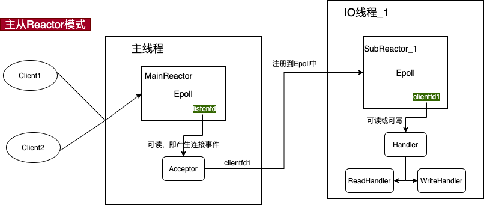

# rocket

## 1.总览
rocket 是基于 C++11 开发的一款多线程的异步 RPC 框架，它旨在高效、简洁的同时，又保持至极高的性能。

rocket 同样是基于主从 Reactor 架构，底层采用 epoll 实现 IO 多路复用。应用层则基于 protobuf 自定义 rpc 通信协议，同时也将支持简单的 HTTP 协议。


这里额外提一句 tinyrpc，看过我之前文章的同学们应该都知道这个。然而很多交流群里的同学都反映 tinyrpc 不是那么容易理解，有种无从下手的感觉。

因此，就引入了 tinyrpc 的简洁版，去掉 tinyrpc 一些晦涩或者不必要的地方，如协程等，但保留其核心的架构，命名为 rocket-rpc.

同时，专门为此项目开设视频课程，将从零开始一步步搭建 rpc 框架，帮助各位同学更好的理解 rpc 的原理。

附：tinyrpc - https://github.com/Gooddbird/tinyrpc


### 1.1 技术栈关键词
- c++11
- protobuf
- rpc
- reactor
- http

### 1.2 学习本课程之前，你需要掌握什么知识？
- 掌握 C++ 语言，至少能熟悉主要的语法、面向对象编程方法等
- 掌握 Linux 环境，熟悉 Linux 网络编程、Socket 编程 等
- 熟悉 Reactor 架构
- 了解 Git 及相关命令
- 了解计算机网络相关知识，如 Tcp 等
- 了解 Protobuf，可以能看懂和编写简单的 protobuf 协议文件
- 了解 rpc 通信原理

### 1.3 学习本课程之后，你将得到哪些知识？
至少当你跟着视频完整开发一遍之后，你将学习到以下技术：
- 一键搭建高性能 rpc 服务，可用于个人网站建站
- 熟悉 RPC 通信的原理，能举一反三，看懂 grpc 等框架
- 熟悉 Reactor 架构，并横向扩展，理解 muduo 等网络框架
- 熟悉 Linux 下 C++ 工程项目开发的通用套路

### 1.4 课程计划
整个项目按以下大纲进行：
- 前置准备，包括环境搭建、依赖库安装
- 日志及配置类开发
- Reactor 核心模块
- Tcp 模块封装
- 序列化、编解码模块
- Rpc 模块封装
- 脚手架搭建
- 简单性能测试

```
1. 环境安装与项目开发
1.1 环境搭建和依赖库安装
1.2 日志模块开发
1.3 配置模块开发

2. EventLoop 模块封装
2.1 EventLoop 核心类构建
2.2 FdEvent 封装以及测试
2.3 定时器 Timer
2.4 主从 Reactor 
2.5 EventLoop 模块整体测试

3. Tcp 模块封装
3.1 TcpBuffer
3.2 TcpConnection 
3.3 TcpServer (一)
3.4 TcpServer (二)
3.4 TcpClient
3.5 Tcp 模块测试 (一)
3.5 Tcp 模块测试 (二)


4. RPC 协议封装
4.1 TinyPB 协议编码
4.2 TinyPB 协议解码
4.3 编解码模块测试

5. RPC 通信模块封装
5.1 RpcController 以及 RcpClosure 等基础类
5.2 RpcDispatcher 分发器
5.3 RpcChannel
5.4 RpcAsyncChannel
5.5 Rpc 模块集成测试

6. RPC 脚手架封装
6.1 代码生成器开发
6.2 项目的构建与测试

```


## 2. 前置准备
### 2.1 环境搭建
- 开发环境：Linux，可以是虚拟机。推荐跟我保持一致，Centos8 的虚拟机. 包含必要的 C++ 开发工具，如 GCC/G++(至少能支持到 C++11 语法的版本)
- 开发工具：VsCode，通过 ssh 远程连接 linux 机器

### 2.2 依赖库的安装
#### 2.2.1 protobuf
protobuf 推荐使用 3.19.4 及其以上：

安装过程：
```
wget  https://github.com/protocolbuffers/protobuf/releases/download/v3.19.4/protobuf-cpp-3.19.4.tar.gz

tar -xzvf protobuf-cpp-3.19.4.tar.gz
```

我们需要指定 安装路径在 `/usr` 目录下:
```
cd protobuf-cpp-3.19.4

./configure -prefix=/usr/local

make -j4 

sudo make install
```

安装完成后，你可以找到头文件将位于 `/usr/include/google` 下，库文件将位于 `/usr/lib` 下。

#### 2.2.2 tinyxml
项目中使用到了配置模块，采用了 xml 作为配置文件。因此需要安装 libtinyxml 解析 xml 文件。

```
wget https://udomain.dl.sourceforge.net/project/tinyxml/tinyxml/2.6.2/tinyxml_2_6_2.zip

unzip tinyxml_2_6_2.zip

```

### 2.3 日志模块开发
首先需要创建项目：

日志模块：
```
1. 日志级别
2. 打印到文件，支持日期命名，以及日志的滚动。
3. c 格式化风控
4. 线程安全
```

LogLevel:
```
Debug
Info
Error
```

LogEvent:
```
文件名、行号
MsgNo
进程号
Thread id
日期，以及时间。精确到 ms
自定义消息
```

日志格式
```
[Level][%y-%m-%d %H:%M:%s.%ms]\t[pid:thread_id]\t[file_name:line][%msg]
```

Logger 日志器
1.提供打印日志的方法
2.设置日志输出的路径


### 2.4 Reactor
Reactor，又可以称为 EventLoop，它的本质是一个事件循环模型。

Rractor(或称 EventLoop)，它的核心逻辑是一个 loop 循环，使用伪代码描述如下：

```c++{.line-numbers}
void loop() {
  while(!stop) {
      foreach (task in tasks) {
        task();
      }

      // 1.取得下次定时任务的时间，与设定time_out去较大值，即若下次定时任务时间超过1s就取下次定时任务时间为超时时间，否则取1s
      int time_out = Max(1000, getNextTimerCallback());
      // 2.调用Epoll等待事件发生，超时时间为上述的time_out
      int rt = epoll_wait(epfd, fds, ...., time_out); 
      if(rt < 0) {
          // epoll调用失败。。
      } else {
          if (rt > 0 ) {
            foreach (fd in fds) {
              // 添加待执行任务到执行队列
              tasks.push(fd);
            }
          }
      }
      
      
  }
}
```

在 rocket 里面，使用的是主从 Reactor 模型，如下图所示：



服务器有一个mainReactor和多个subReactor。

mainReactor由主线程运行，他作用如下：通过epoll监听listenfd的可读事件，当可读事件发生后，调用accept函数获取clientfd，然后随机取出一个subReactor，将cliednfd的读写事件注册到这个subReactor的epoll上即可。也就是说，mainReactor只负责建立连接事件，不进行业务处理，也不关心已连接套接字的IO事件。

subReactor通常有多个，每个subReactor由一个线程来运行。subReactor的epoll中注册了clientfd的读写事件，当发生IO事件后，需要进行业务处理。

#### 2.4.1 TimerEvent 定时任务
```
1. 指定时间点 arrive_time
2. interval, ms。
3. is_repeated 
4. is_cancled
5. task


cancle()
cancleRepeated()
```

#### 2.4.2 Timer
定时器，他是一个 TimerEvent 的集合。
Timer 继承 FdEvent
```

addTimerEvent();
deleteTimerEvent();

onTimer();    // 当发生了 IO 事件之后，需要执行的方法


reserArriveTime()

multimap 存储 TimerEvent <key(arrivetime), TimerEvent>
```

#### 2.5 IO 线程
创建一个IO 线程，他会帮我们执行：
1. 创建一个新线程（pthread_create）
2. 在新线程里面 创建一个 EventLoop，完成初始化
3. 开启 loop
```
class {


 pthread_t m_thread;
 pid_t m_thread_id;
 EventLoop event_loop;
}

```


